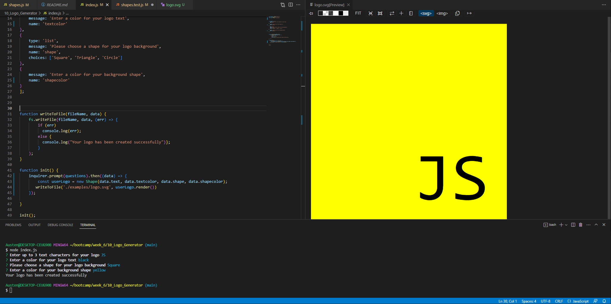

# Logo Generator

## Description
Takes user input and generates a simple logo including text, a background shape, and color.

## Installation
To install the dependencies, run 'npm i' in your terminal while in the program directory. Then just type 'node index.js' in the terminal and you will see the inquirer prompt

## Usage
Navigate to the program directory in your terminal then type 'node index.js' to start the prompt. Answer each of the design questions and your logo will be generated upon completion inside the 'examples' directory.

[Link to Demo Video](https://drive.google.com/file/d/1ziHf1TwYp0wmn4Nu0-86GcRwmpV7fvrF/view)

## Credits
n/a